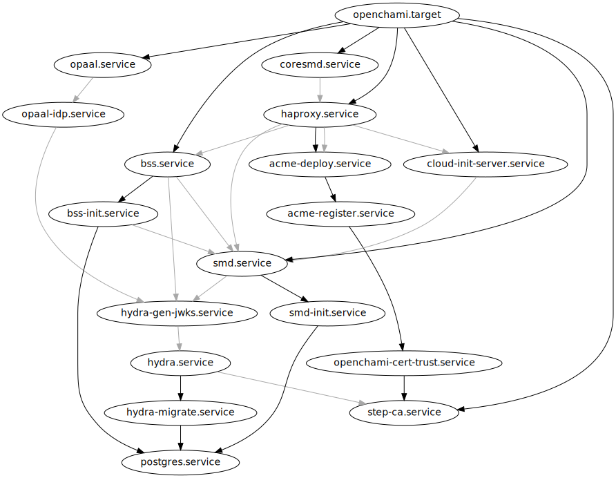

# Phase I — Platform Setup

1. **Instance Preparation**
   - Host packages, kernel modules, cgroups, bridge setup, storage directories setup
   - Deploy MinIO, nginx, and registry
   - Checkpoints:
     - `systemctl status minio`
     - `systemctl status registry`
2. **OpenCHAMI & Core Services**
   - Install OpenCHAMI RPMs
   - Deploy internal Certificate Authority and import signing certificate
   - Checkpoints:
     - `ochami bss status`
     - `systemctl list-dependencies openchami.target`

## 1.0 Contents

- [Phase I — Platform Setup](#phase-i--platform-setup)
  - [1.0 Contents](#10-contents)
  - [1.1 Set Up Storage Directories](#11-set-up-storage-directories)
  - [1.2 Set Up Internal Network and Hostnames](#12-set-up-internal-network-and-hostnames)
    - [1.2.1 Create and Start Internal Network](#121-create-and-start-internal-network)
    - [1.2.2 Update `/etc/hosts`](#122-update-etchosts)
  - [1.3 Enable Non-OpenCHAMI Services](#13-enable-non-openchami-services)
    - [1.3.1 S3](#131-s3)
    - [1.3.2 Container Registry](#132-container-registry)
    - [1.3.3 Reload Systemd](#133-reload-systemd)
    - [1.3.4 Checkpoint](#134-checkpoint)
  - [🛑 ***STOP HERE***](#-stop-here)
  - [1.4 Install OpenCHAMI](#14-install-openchami)
    - [1.4.1 Update `coredhcp` Configuration](#141-update-coredhcp-configuration)
  - [1.5 Configure Cluster FQDN for Certificates](#15-configure-cluster-fqdn-for-certificates)
  - [1.6 Start OpenCHAMI](#16-start-openchami)
    - [Troubleshooting](#troubleshooting)
      - [Dependency Issue](#dependency-issue)
      - [Certificates](#certificates)
    - [1.6.1 Service Configuration](#161-service-configuration)
  - [1.7 Install and Configure OpenCHAMI Client](#17-install-and-configure-openchami-client)
    - [1.7.1 Installation](#171-installation)
    - [1.7.2 Configuration](#172-configuration)
    - [1.7.3 Documentation](#173-documentation)
  - [1.8 Generating Authentication Token](#18-generating-authentication-token)
  - [1.9 Checkpoint](#19-checkpoint)
  - [🛑 ***STOP HERE***](#-stop-here-1)

---

> [!WARNING]
> **Avoid running everything in a root shell.** It's tempting to avoid having to run `sudo` every time, but this will have unintended side effects.

## 1.1 Set Up Storage Directories

Our tutorial uses S3 to serve the system images (in SquashFS format) for the diskless VMs. A container registry is also used to store system images (in OCI format) for reuse in other image layers (we'll go over this later).
They all need separate directories.

Create a local directory for storing the container images:

```bash
sudo mkdir -p /data/oci
sudo chown -R rocky: /data/oci
```

Create a local directory for S3 access to images:

```bash
sudo mkdir -p /data/s3
sudo chown -R rocky: /data/s3
```

SELinux treats home directories specially. To avoid cgroups conflicting with SELinux enforcement, we set up a working directory outside our home directory:

```bash
sudo mkdir -p /opt/workdir
sudo chown -R rocky: /opt/workdir
cd /opt/workdir
```

## 1.2 Set Up Internal Network and Hostnames

The containers expect that an internal network be set up with a domain name for our OpenCHAMI services.

### 1.2.1 Create and Start Internal Network

Let's configure our head node to forward traffic from the compute nodes:

```bash
sudo sysctl -w net.ipv4.ip_forward=1
```

Now, let's create an internal Libvirt network that will be used as the network interface on our head node that our virtual compute nodes will be attached to:

```bash
cat <<EOF > openchami-net.xml
<network>
  <name>openchami-net</name>
  <bridge name="virbr-openchami" />
  <forward mode='route'/>
   <ip address="172.16.0.254" netmask="255.255.255.0">
   </ip>
</network>
EOF

sudo virsh net-define openchami-net.xml
sudo virsh net-start openchami-net
sudo virsh net-autostart openchami-net
```

We can check that the network got created:

```bash
sudo virsh net-list
```

The output should be:

```
 Name            State    Autostart   Persistent
--------------------------------------------------
 default         active   yes         yes
 openchami-net   active   yes         yes
```

### 1.2.2 Update `/etc/hosts`

Add our cluster's service domain to `/etc/hosts` so that the certificates will work:

```bash
echo "172.16.0.254 demo.openchami.cluster" | sudo tee -a /etc/hosts > /dev/null
```

## 1.3 Enable Non-OpenCHAMI Services

> [!NOTE]
> Files in this section need to be edited as root!

### 1.3.1 S3

For our S3 gateway, we use [Minio](https://github.com/minio/minio) which we'll define as a quadlet and start.

Like all the OpenCHAMI services, we create a quadlet definition in `/etc/containers/systemd/` for our S3 service.

**Edit: `/etc/containers/systemd/minio.container`**

```ini
[Unit]
Description=Minio S3
After=local-fs.target network-online.target
Wants=local-fs.target network-online.target

[Container]
ContainerName=minio-server
Image=docker.io/minio/minio:latest
# Volumes
Volume=/data/s3:/data:Z

# Ports
PublishPort=9000:9000
PublishPort=9001:9001

# Environemnt Variables
Environment=MINIO_ROOT_USER=admin
Environment=MINIO_ROOT_PASSWORD=admin123

# Command to run in container
Exec=server /data --console-address :9001

[Service]
Restart=always

[Install]
WantedBy=multi-user.target
```

### 1.3.2 Container Registry

For our OCI container registry, we use the standard docker registry.  Once again, deployed as a quadlet.

**Edit: `/etc/containers/systemd/registry.container`**

```ini
[Unit]
Description=Image OCI Registry
After=network-online.target
Requires=network-online.target

[Container]
ContainerName=registry
HostName=registry
Image=docker.io/library/registry:latest
Volume=/data/oci:/var/lib/registry:Z
PublishPort=5000:5000

[Service]
TimeoutStartSec=0
Restart=always

[Install]
WantedBy=multi-user.target
```

### 1.3.3 Reload Systemd

Reload Systemd to update it with our new changes and then start the services:

```bash
sudo systemctl daemon-reload
sudo systemctl start minio.service
sudo systemctl start registry.service
```

### 1.3.4 Checkpoint

Make sure the S3 (`minio`) and OCI (`registry`) services are up and running.

**Quickly:**

```bash
for s in minio registry; do echo -n "$s: "; systemctl is-failed $s; done
```

The output should be:

```
minio: active
registry: active
```

**More detail:**

```bash
systemctl status minio
systemctl status registry
```

🛑 ***STOP HERE***
---

## 1.4 Install OpenCHAMI

Now, we need install the OpenCHAMI services. Luckily, there is [a release RPM](https://github.com/openchami/release) for this that provides signed RPMs. We'll install the latest version.

**Run the commands below in the `/opt/workdir` directory!**

```bash
# Set repository details
OWNER="openchami"
REPO="release"

# Identify the latest release RPM
API_URL="https://api.github.com/repos/${OWNER}/${REPO}/releases/latest"
release_json=$(curl -s "$API_URL")
rpm_url=$(echo "$release_json" | jq -r '.assets[] | select(.name | endswith(".rpm")) | .browser_download_url' | head -n 1)
rpm_name=$(echo "$release_json" | jq -r '.assets[] | select(.name | endswith(".rpm")) | .name' | head -n 1)

# Download the RPM
curl -L -o "$rpm_name" "$rpm_url"

# Install the RPM
sudo rpm -Uvh "$rpm_name"
```

### 1.4.1 Update `coredhcp` Configuration

The release RPM unpacks config files for many of the services including `coredhcp`. We need to edit the `/etc/openchami/configs/coredhcp.yaml` config file and uncomment all the values if you see an error when booting. The file should look like this:

```
server4:
# You can configure the specific interfaces that you want OpenCHAMI to listen on by 
# uncommenting the lines below and setting the interface
  listen:
    - "%virbr-openchami"
  plugins:
# You are able to set the IP address of the system in server_id as the place to look for a DHCP server
# DNS is able to be set to whatever you want but it is much easier if you keep it set to the server IP
# Router is also able to be set to whatever you network router address is 
    - server_id: 172.16.0.254
    - dns: 172.16.0.254
    - router: 172.16.0.254
    - netmask: 255.255.255.0
# The lines below define where the system should assign ip addresses for systems that do not have
# mac addresses stored in SMD
    - coresmd: https://demo.openchami.cluster:8443 http://172.16.0.254:8081 /root_ca/root_ca.crt 30s 1h false
    - bootloop: /tmp/coredhcp.db default 5m 172.16.0.200 172.16.0.250
```

This will allow the compute node later in the tutorial to request its PXE script.

## 1.5 Configure Cluster FQDN for Certificates

OpenCHAMI includes a minimal, open source certificate authority from [Smallstep](https://smallstep.com/) that is run via the `step-ca` service. The certificate generation and deployment happens as follows:

1. `step-ca.service` -- Generates the certificate authority certificate.
2. `openchami-cert-trust.service` -- Copies the generated CA certificate to the host system and adds it to the system trust bundle.
3. `acme-register.service` -- Issues a new certificate (derived from the CA certificate) for haproxy, the API gateway.
4. `acme-deploy.service` -- Deploys the issued certificate to haproxy. Restarting this service will restart 1-3 as well.

The `acme-*` services handle certificate rotation, and the `openchami-cert-renewal` service and Systemd timer do exactly this.

When OpenCHAMI is installed, the FQDN used for the certificates and services is set to the hostname of the system the package is installed on. We need to change this to `demo.openchami.cluster` which is what we will be using. The OpenCHAMI package provides us with a script to do this:

```
sudo openchami-certificate-update update demo.openchami.cluster
```

You should see the following output:

```
Changed FQDN to demo.openchami.cluster
Either restart all of the OpenCHAMI services:

  sudo systemctl restart openchami.target

or run the following to just regenerate/redeploy the certificates:

  sudo systemctl restart acme-deploy

```

The script tells we can either restart all of the OpenCHAMI services (`openchami.target`) or restart `acme-deploy` to regenerate the certificates. Since we are running OpenCHAMI for the first time, we will be running the former, but **not yet**.

To see what the script changed, run:

```
grep -RnE 'demo|openchami\.cluster' /etc/openchami/configs/openchami.env /etc/containers/systemd/
```

We will be able to verify if this worked shortly.

## 1.6 Start OpenCHAMI

OpenCHAMI runs as a collection of containers. Podman's integration with Systemd allows us to start, stop, and trace OpenCHAMI as a set of dependent Systemd services through the `openchami.target` unit.

```bash
sudo systemctl start openchami.target
systemctl list-dependencies openchami.target
```

> [!TIP]
> We can use `watch` to dynamically see the services starting:
> ```
> watch systemctl list-dependencies openchami.target
> ```

If the services started correctly, the second command above should yield:

```
openchami.target
● ├─acme-deploy.service
● ├─acme-register.service
● ├─bss-init.service
● ├─bss.service
● ├─cloud-init-server.service
● ├─coresmd.service
● ├─haproxy.service
● ├─hydra-gen-jwks.service
● ├─hydra-migrate.service
● ├─hydra.service
● ├─opaal-idp.service
● ├─opaal.service
● ├─openchami-cert-trust.service
● ├─postgres.service
● ├─smd.service
● └─step-ca.service
```

> [!TIP]
> If the `haproxy` container fails with the following error, try restarting the `opaal` and `haproxy` containers.
> ```bash
> Jul 15 01:29:27 happily-humble-loon.novalocal haproxy[363101]: [ALERT]    (3) : [/usr/local/etc/haproxy/haproxy.cfg:55] : 'server opaal/opaal' : could not resolve address 'opaal'.
> Jul 15 01:29:27 happily-humble-loon.novalocal haproxy[363101]: [ALERT]    (3) : [/usr/local/etc/haproxy/haproxy.cfg:58] : 'server opaal-idp/opaal-idp' : could not resolve address 'opaal-idp'.
> ```

Check the [**Troubleshooting**](#troubleshooting) subsection below if issues arise.

### Troubleshooting

If a service fails (if `×` appears next to a service in the `systemctl list-dependencies` command), try using `journalctl -eu <service_name>` to look at the logs

#### Dependency Issue

If a service fails because of another dependent service, use the following dependency chart diagram to pinpoint the service causing the dependency failure. Black arrows are hard dependencies (service will fail if dependent service not started) and grey arrows are soft dependencies.



#### Certificates

One common issue is with certificates. If TLS errors are occurring, **make sure the domain in the `acme-register.container` and `acme-deploy.container` files within `/etc/containers/systemd/` (argument to `-d` flag) match the cluster domain set in `/etc/hosts`.**

Since the release RPM automatically sets the FQDN for you, it may be necessary to update it to the correct value.

```bash
sudo openchami-certificate-update update demo.openchami.cluster
```

After ensuring the above or the error is of a different cause, regenerating the OpenCHAMI certificates can usually solve such issues. This can be done with:

```
sudo systemctl restart acme-deploy
```

### 1.6.1 Service Configuration

The OpenCHAMI release RPM is created with sensible default configurations for this tutorial and all configuration files are included in the `/etc/openchami` directory.  To understand each one in detail, review the [**Service Configuration**](service_configuration.md) instructions

## 1.7 Install and Configure OpenCHAMI Client

The [`ochami` CLI](https://github.com/OpenCHAMI/ochami) provides us an easy way to interact with the OpenCHAMI services.

### 1.7.1 Installation

We can install the latest RPM with the following:

```bash
latest_release_url=$(curl -s https://api.github.com/repos/OpenCHAMI/ochami/releases/latest | jq -r '.assets[] | select(.name | endswith("amd64.rpm")) | .browser_download_url')
curl -L "${latest_release_url}" -o ochami.rpm
sudo dnf install -y ./ochami.rpm
```

As a sanity check, check the version to make sure it is installed properly:

```bash
ochami version
```

The output should look something like:

```
Version:    0.3.4
Tag:        v0.3.4
Branch:     HEAD
Commit:     78a2b046518839bbd8283804905e1648dd739927
Git State:  clean
Date:       2025-06-02T21:19:21Z
Go:         go1.24.3
Compiler:   gc
Build Host: fv-az1758-958
Build User: runner
```

### 1.7.2 Configuration

To configure `ochami` to be able to communicate with our cluster, we need to create a config file. We can create one in one fell swoop with:

```bash
sudo ochami config cluster set --system --default demo cluster.uri https://demo.openchami.cluster:8443
```

This will create a system-wide config file at `/etc/ochami/config.yaml`. We can check that `ochami` is reading it properly with:

```bash
ochami config show
```

We should see:

```yaml
clusters:
    - cluster:
        uri: https://demo.openchami.cluster:8443
      name: demo
default-cluster: demo
log:
    format: rfc3339
    level: warning
```

Now we should be able to communicate with our cluster. Let's make sure by checking the status of one of the services:

```bash
ochami bss status
```

We should get:

```json
{"bss-status":"running"}
```

> [!TIP]
> If TLS errors occur, see the [**Certificates**](#certificates) subsection within the [**Troubleshooting**](#troubleshooting) section above.

Voilà!

### 1.7.3 Documentation

`ochami` comes with several manual pages. Run:

```
apropos ochami
```

and you'll see:

```
ochami (1)           - OpenCHAMI command line interface
ochami-bss (1)       - Communicate with the Boot Script Service (BSS)
ochami-cloud-init (1) - Communicate with the cloud-init server
ochami-config (1)    - Manage configuration for ochami CLI
ochami-config (5)    - ochami CLI configuration file
ochami-discover (1)  - Populate SMD using a file
ochami-pcs (1)       - Communicate with the Power Control Service (PCS)
ochami-smd (1)       - Communicate with the State Management Database (SMD)
```

## 1.8 Generating Authentication Token

In order to interact with protected endpoints, we will need to generate a JSON Web Token (JWT, pronounced _jot_). `ochami` reads an environment variable named `<CLUSTER_NAME>_ACCESS_TOKEN` where `<CLUSTER_NAME>` is the configured name of the cluster in all capitals, `DEMO` in our case.

Since we aren't using an external identity provider, we will use OpenCHAMI's internal one to generate a token. The RPM we installed comes with some shell functions that allow us to do this.

```bash
export DEMO_ACCESS_TOKEN=$(sudo bash -lc 'gen_access_token')
```

> [!TIP]
> **Keep this command handy! Tokens expire after an hour.**
>
> If you see:
> ```
> Environment variable DEMO_ACCESS_TOKEN unset for reading token for cluster "demo"
> ```
> when running the `ochami` command later, it is time to rerun this command.

Note that `sudo` is needed because the containers are running as root and so if `sudo` is omitted, the containers will not be found.

OpenCHAMI tokens last for an hour by default. Whenever one needs to be regenerated, run the above command.

## 1.9 Checkpoint

1. ```bash
   systemctl list-dependencies openchami.target
   ```
   should yield:
   ```bash
   openchami.target
   ● ├─acme-deploy.service
   ● ├─acme-register.service
   ● ├─bss-init.service
   ● ├─bss.service
   ● ├─cloud-init-server.service
   ● ├─coresmd.service
   ● ├─haproxy.service
   ● ├─hydra-gen-jwks.service
   ● ├─hydra-migrate.service
   ● ├─hydra.service
   ● ├─opaal-idp.service
   ● ├─opaal.service
   ● ├─openchami-cert-trust.service
   ● ├─postgres.service
   ● ├─smd.service
   ● └─step-ca.service
   ```
1. ```
   ochami bss status
   ```
   should yield:
   ```
   {"bss-status":"running"}
   ```
1. ```
   ochami smd status
   ```
   should yield:
   ```
   {"code":0,"message":"HSM is healthy"}
   ```

🛑 ***STOP HERE***
---
